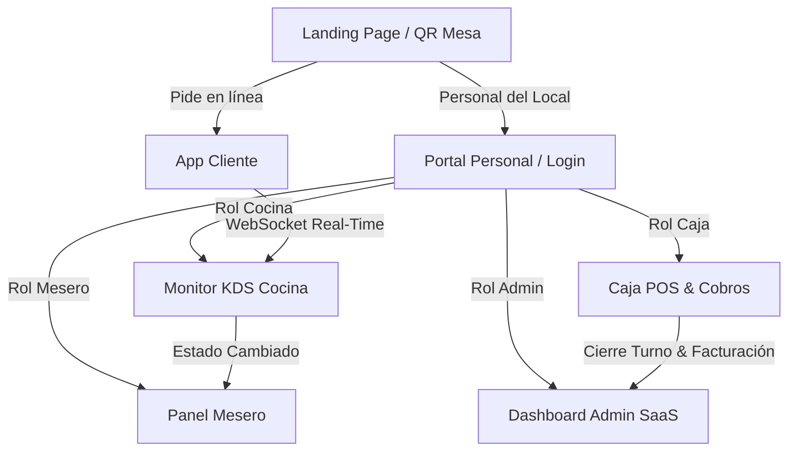

# Design System — DONDE DAVID Enterprise

El **Design System de DONDE DAVID** centraliza todos los tokens visuales, la psicología del color, la escala tipográfica, el sistema de espaciado y la librería de componentes para asegurar coherencia visual y funcional en toda la plataforma.

---

## 🎨 1. DESIGN TOKENS (`:root`)

```css
:root {
  /* Brand Palette */
  --brand-navy: #071A3D;      /* Estructura, sidebar, headers, modo oscuro */
  --brand-navy-dark: #0B2557; /* Superficie secundaria navy */
  --brand-blue: #0879E8;      /* Tecnología, links, estados activos */
  --brand-blue-light: #EAF4FF;/* Fondos suaves de información */
  --brand-orange: #FF7A00;    /* CTAs primarios, precios destacados, acción */
  --brand-orange-dark: #D95F00;/* Hover de CTAs */
  --brand-yellow: #FFC400;    /* Promociones, insignias "BOOM!", estrellas */

  /* Semantic Feedback */
  --success: #22C55E;         /* Pedido listo, pagado, disponible */
  --danger: #F21D1D;          /* Errores, urgencia >15 min en KDS, cancelaciones */
  --warning: #F59E0B;         /* En cola, atención requerida */

  /* Theme Surfaces (Dark Theme Default) */
  --bg-main: #0B111E;
  --bg-surface: #111827;
  --bg-card: rgba(17, 24, 39, 0.85);
  --color-dark: #111318;
  --color-border: #1E293B;

  /* Typography Colors */
  --text-primary: #F8FAFC;
  --text-secondary: #94A3B8;
  --text-muted: #64748B;

  /* Borders & Dividers */
  --border: #1E293B;
  --disabled: #334155;

  /* Border Radii */
  --radius-sm: 8px;
  --radius-md: 12px;
  --radius-lg: 16px;
  --radius-xl: 24px;
  --radius-full: 9999px;

  /* Shadows (Depth & Glow) */
  --shadow-sm: 0 2px 8px rgba(0, 0, 0, 0.2);
  --shadow-md: 0 8px 24px rgba(0, 0, 0, 0.35);
  --shadow-lg: 0 16px 40px rgba(0, 0, 0, 0.5);
  --shadow-orange: 0 6px 20px rgba(255, 122, 0, 0.35);
  --shadow-glow: 0 0 20px rgba(8, 121, 232, 0.25);

  /* Spacing Scale */
  --spacing-4: 4px;
  --spacing-8: 8px;
  --spacing-12: 12px;
  --spacing-16: 16px;
  --spacing-24: 24px;
  --spacing-32: 32px;
  --spacing-48: 48px;
  --spacing-64: 64px;

  /* Micro-interactions */
  --transition-fast: 150ms cubic-bezier(0.4, 0, 0.2, 1);
  --transition-base: 200ms cubic-bezier(0.4, 0, 0.2, 1);
  --transition-smooth: 250ms cubic-bezier(0.4, 0, 0.2, 1);
}
```

---

## 🔤 2. ESCALA TIPOGRÁFICA (INTER + OUTFIT)

- **H1**: `font-weight: 900`, `font-size: clamp(2.2rem, 5vw, 3.8rem)` (Impactante).
- **H2**: `font-weight: 800`, `font-size: clamp(1.6rem, 3vw, 2.5rem)`.
- **H3**: `font-weight: 800`, `font-size: 1.25rem`.
- **Body**: `font-weight: 400`, `font-size: 1rem`, `line-height: 1.5`.
- **Labels**: `font-weight: 700`, `font-size: 0.88rem`.
- **Numbers & Prices**: `font-weight: 900`, `font-family: 'Outfit', sans-serif`.

---

## 🧩 3. LIBRERÍA DE COMPONENTES REUTILIZABLES

1. **Button**:
   - `Primary / CTA`: Fondo Naranja `#FF7A00` (`.btn-cta`).
   - `Secondary`: Fondo Azul `#0879E8` (`.btn-primary`).
   - `Danger`: Fondo Rojo `#F21D1D` (`.btn-danger`).
   - `Success`: Fondo Verde `#22C55E` (`.btn-success`).
   - `Outline`: Fondo transparente con borde `#1E293B` (`.btn-outline`).
2. **Componente Card Reutilizable (`.card`)**:
   - Glassmorphism translúcido `backdrop-filter: blur(12px)`.
   - Sombras y elevación en hover `translateY(-4px)` con `box-shadow` e iluminación de borde.
   - Animación de entrada fluida `.fade-in` con `@keyframes fadeIn`.
   - Variaciones: `.product-card` (borde naranja en hover) y `.review-card` (borde amarillo en hover).
3. **Barra de Navegación Inferior (`.bottom-bar`)**:
   - Posicionamiento fijo `position: fixed; bottom: 0; left: 0; width: 100%`.
   - Glassmorphic blur con backdrop-filter y estado activo resaltado (`.active`) con retroalimentación táctil/hover.
   - Visualización en móviles y pantallas reducidas (`< 900px`), ocultando el sidebar tradicional.
4. **Modo Oscuro / Modo Claro (`toggleThemeMode()`)**:
   - Interruptor con cambio dinámico de variables y clases (`body.light-theme`).
   - Persistencia automática de preferencia en `localStorage` (`app_theme`).
5. **Form Inputs**:
   - Padding (`0.75rem 1rem`), min-height de `44px`, borde `#1E293B` y anillo de foco visible (`:focus-visible`).
6. **Multimodal Badges (WCAG 2.1)**:
   - Icono + Texto + Color (`.badge-PENDIENTE`, `.badge-EN_PREPARACION`, `.badge-LISTO`, `.badge-CANCELADO`).
7. **Toasts**:
   - Notificaciones emergentes superiores con timer y auto-dismiss (`toast-success`, `toast-warning`, `toast-danger`).

---

## 📐 4. GUÍA VISUAL DEL FLUJO DE UI


