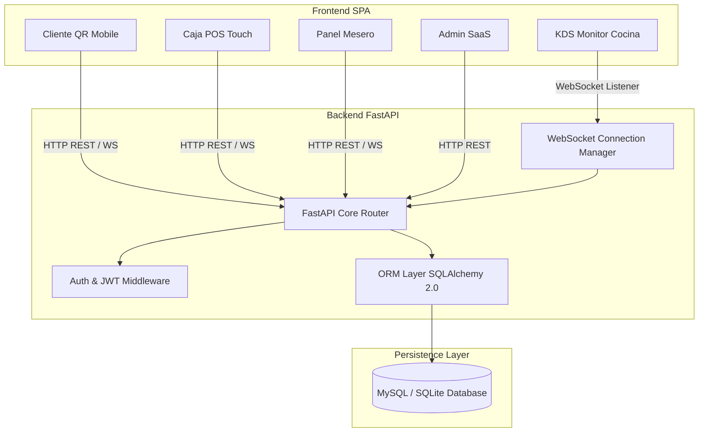

# 🏗️ ARCHITECTURE.md — Arquitectura del Sistema DONDE DAVID

Este documento especifica la arquitectura técnica, los componentes clave, los patrones de diseño y la infraestructura del sistema **DONDE DAVID - FRESH & TASTY!**.

---

## 📌 1. Visión General de la Arquitectura

El sistema está estructurado mediante una **Arquitectura Cliente-Servidor Modular Desacoplada**, donde el backend FastAPI expone servicios RESTful API de alto rendimiento y canales bidireccionales en tiempo real mediante WebSockets, mientras que el frontend consumible mediante HTML5/CSS3/Vanilla JS ejecuta una experiencia SPA (Single Page Application) responsiva multimodular.

---

## 🛠️ 2. Stack Tecnológico

| Capa | Tecnología | Versión | Propósito |
|---|---|---|---|
| **Backend Core** | FastAPI | `0.109.2` | Framework asíncrono Python de alto rendimiento |
| **ORM** | SQLAlchemy | `2.0.25` | Mapeo objeto-relacional asíncrono/síncrono |
| **Base de Datos** | MySQL / SQLite | `8.0+` | Almacenamiento persistente ACID de alta disponibilidad |
| **Autenticación** | PyJWT / Passlib (Bcrypt) | `3.3.0` | Tokens JWT firmados con Hashing seguro Bcrypt |
| **Tiempo Real** | WebSockets | `12.0` | Notificaciones push bidireccionales instantáneas |
| **Validación** | Pydantic V2 | `2.5.0` | Esquemas y serialización estricta de datos |
| **Frontend** | HTML5 / CSS3 / JS Vanilla ES6+ | N/A | Interfaz ultra ligera sin dependencias de Node heavy |

---

## 🔄 3. Flujo en Tiempo Real vía WebSockets

El `ConnectionManager` gestiona todas las conexiones activas agrupadas por tipos de evento.

1. **Nuevo Pedido**: El cliente realiza un pedido desde el móvil vía `/api/v1/cliente/pedidos`.
2. **Notificación KDS**: El backend emite `nuevo_pedido` por WebSocket a la cocina en `< 50ms`.
3. **Cambio de Estado**: Cocina actualiza estado a `listo`. El WebSocket notifica al cliente y al panel de meseros/caja de inmediato.

---

## 🔒 4. Capa de Seguridad y RBAC

- **Autenticación JWT Bearer**: Requerida en todos los endpoints privados.
- **Control de Acceso Basado en Roles (RBAC)**:
  - `admin`: Acceso completo CRUD y configuración.
  - `supervisor`: Acceso a reportes y supervisión.
  - `caja`: Apertura/cierre de turnos y cobro de pedidos.
  - `cocina`: Monitor KDS y actualización de estado de platos.
  - `cliente`: Menú público y creación de pedidos.
- **Protección Multimoneda y Re-cálculo Server-Side**: Los subtotales, IVA y conversiones a Bolívares (Bs.) se recalculan exclusivamente en el backend para prevenir manipulaciones en cliente.
