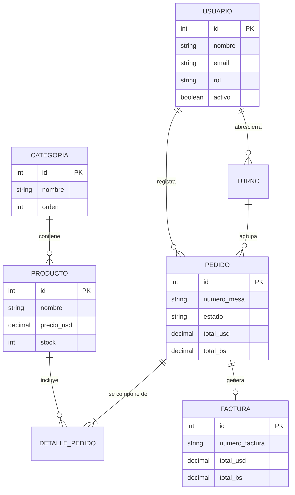

# 📊 DATABASE.md — Modelo Relacional de Datos

Este documento define la arquitectura física de la base de datos relacional de **DONDE DAVID - FRESH & TASTY!**.

---

## 📐 Diagrama Entidad-Relación (Mermaid)



---

## 🗄️ Esquema DDL SQL

```sql
-- Usuarios
CREATE TABLE usuarios (
    id INT PRIMARY KEY AUTO_INCREMENT,
    nombre VARCHAR(100) NOT NULL,
    apellido VARCHAR(100) NOT NULL,
    email VARCHAR(255) UNIQUE NOT NULL,
    nombre_usuario VARCHAR(50) UNIQUE NOT NULL,
    contraseña_hash VARCHAR(255) NOT NULL,
    rol ENUM('admin','supervisor','caja','cocina','cliente') NOT NULL,
    activo BOOLEAN DEFAULT TRUE,
    fecha_creacion DATETIME DEFAULT CURRENT_TIMESTAMP
);

-- Categorías
CREATE TABLE categorias (
    id INT PRIMARY KEY AUTO_INCREMENT,
    nombre VARCHAR(100) UNIQUE NOT NULL,
    descripcion VARCHAR(255),
    icono VARCHAR(50),
    orden INT DEFAULT 0,
    activo BOOLEAN DEFAULT TRUE
);

-- Productos
CREATE TABLE productos (
    id INT PRIMARY KEY AUTO_INCREMENT,
    nombre VARCHAR(150) NOT NULL,
    descripcion TEXT,
    precio_usd DECIMAL(10,2) NOT NULL,
    precio_promocion_usd DECIMAL(10,2),
    stock INT DEFAULT 0,
    stock_minimo INT DEFAULT 5,
    imagen_url VARCHAR(255),
    tiempo_preparacion INT DEFAULT 15,
    activo BOOLEAN DEFAULT TRUE,
    categoria_id INT NOT NULL,
    FOREIGN KEY (categoria_id) REFERENCES categorias(id)
);

-- Configuraciones
CREATE TABLE configuraciones (
    id INT PRIMARY KEY AUTO_INCREMENT,
    clave VARCHAR(100) UNIQUE NOT NULL,
    valor VARCHAR(500) NOT NULL,
    descripcion VARCHAR(255)
);

-- Turnos
CREATE TABLE turnos (
    id INT PRIMARY KEY AUTO_INCREMENT,
    numero_turno INT NOT NULL,
    fecha_apertura DATETIME DEFAULT CURRENT_TIMESTAMP,
    fecha_cierre DATETIME,
    monto_apertura_usd DECIMAL(10,2) DEFAULT 0.00,
    monto_cierre_usd DECIMAL(10,2),
    total_ventas_usd DECIMAL(10,2) DEFAULT 0.00,
    tasa_cambio_apertura DECIMAL(10,2),
    activo BOOLEAN DEFAULT TRUE,
    usuario_caja_id INT NOT NULL,
    FOREIGN KEY (usuario_caja_id) REFERENCES usuarios(id)
);

-- Pedidos
CREATE TABLE pedidos (
    id INT PRIMARY KEY AUTO_INCREMENT,
    numero_mesa VARCHAR(10),
    tipo ENUM('mesa','delivery','para_llevar') NOT NULL,
    estado ENUM('pendiente','en_preparacion','listo','entregado','cancelado') NOT NULL,
    total_usd DECIMAL(10,2) NOT NULL DEFAULT 0.00,
    total_bs DECIMAL(10,2) NOT NULL DEFAULT 0.00,
    tasa_cambio_aplicada DECIMAL(10,2),
    fecha_creacion DATETIME DEFAULT CURRENT_TIMESTAMP,
    usuario_id INT NOT NULL,
    turno_id INT,
    FOREIGN KEY (usuario_id) REFERENCES usuarios(id),
    FOREIGN KEY (turno_id) REFERENCES turnos(id)
);
```
